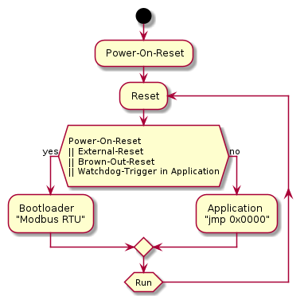

# bootloader: AVR bootloader with Modbus RTU support
================================================================================

Overview
--------------------------------------------------------------------------------
bootloader can be used to update/manage devices connected to Modbus network.
Without the need for ISP programmer or physical contact with the device.

Dependencies
--------------------------------------------------------------------------------
Compile time dependencies are managed with Git submodules. Please keep in mind
to use appropriate switches (like --recurse-submodules).

1. https://github.com/wdl83/atmega328p_drv
1. https://github.com/wdl83/modbus_c

Supported devices
--------------------------------------------------------------------------------
atmega328p: all development and testing is done with Arduino Pro Mini (clones).

Building
--------------------------------------------------------------------------------
1. git clone --recurse-submodules https://github.com/wdl83/bootloader
1. cd bootloader
1. RELEASE=1 make

Building with Docker
--------------------------------------------------------------------------------
1. git clone https://github.com/wdl83/bootloader
1. cd bootloader
1. ./make_env.sh # generate .env
1. sudo docker-compose up
1. grep DST= .env # directory where artifacts are located

Boot decision
--------------------------------------------------------------------------------

